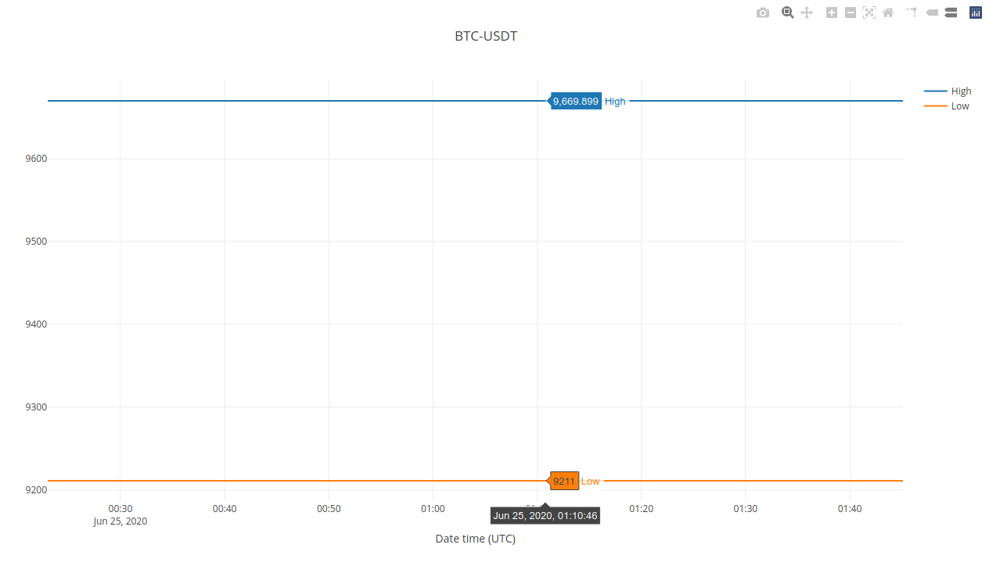

# somdata-market-graph


## Install
```shell
virtualenv venv -p python3
source venv/bin/activate

pip install -e .
cd src
python manage.py makemigrations server
python manage.py migrate
```
## Run tests
```shell
pip install -e .[testing]
pytest
```

## Run APP
```shell
cd src
python manage.py runserver
```
Open APP URL http://localhost:8000
